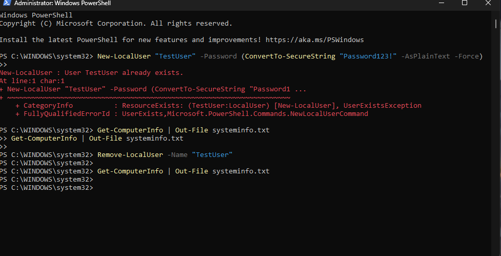

# ⚡ PowerShell Automation Lab

## 📌 Overview
This project demonstrates beginner-level PowerShell automation used in IT support and system administration. The tasks include creating and removing local users, collecting system information, redirecting output to a file, and handling common PowerShell errors.

---

## 🛠️ Automation Tasks Demonstrated

### ✔️ 1. Create a New Local User (Scripted)
PowerShell command used:
New-LocalUser "TestUser" -Password (ConvertTo-SecureString "Password123!" -AsPlainText -Force)

This automates user creation without needing the graphical interface.

---

### ✔️ 2. Export System Information to a File
Collected detailed device information and exported it to a readable text file:
Get-ComputerInfo | Out-File systeminfo.txt

---

### ✔️ 3. Remove the Local User
Removed the TestUser account using:
Remove-LocalUser -Name "TestUser"

---

## 📸 Screenshot Evidence

This screenshot shows:
- Creating a new user
- User already exists error handling
- Exporting system information
- Removing the local user
- Re-running the export command

---

## 🧾 Commands Used (Summary)

### `New-LocalUser`
Creates a new local Windows account.

### `Get-ComputerInfo`
Outputs full OS, system, hardware, BIOS, and device details.

### `Out-File`
Saves PowerShell output to a `.txt` file.

### `Remove-LocalUser`
Deletes a local user account.

---

## 🧠 Lessons Learned
- How PowerShell automates system administration
- How to create and remove users without GUI tools
- How to capture system information for logs or audits
- How PowerShell handles command errors
- Why automation is vital for IT and cloud engineering roles

---

## 📁 Repository Structure
PowerShell-Automation/
│
├── README.md
│
├── screenshots/
│   └── powershell_user_script.png
│
├── systeminfo.txt
│
└── scripts/
    ├── create-user.ps1
    ├── remove-user.ps1
    └── export-systeminfo.ps1

---

## 📚 Tools Used
- Windows PowerShell
- Built-in cmdlets: New-LocalUser, Get-ComputerInfo, Out-File, Remove-LocalUser

---

## ✅ Status
✔️ User automation completed  
✔️ System export completed  
✔️ Screenshot included  
✔️ Recruiter-ready  
